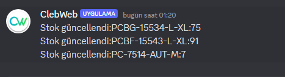
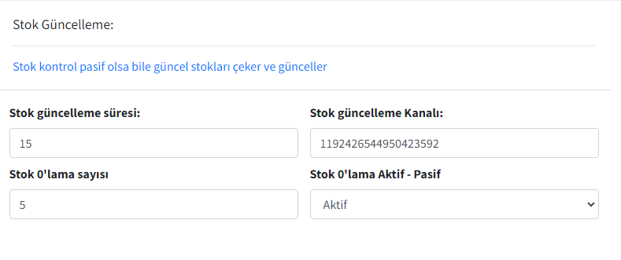
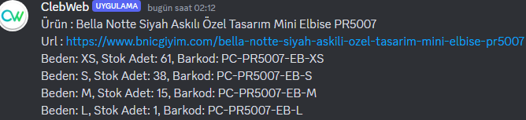
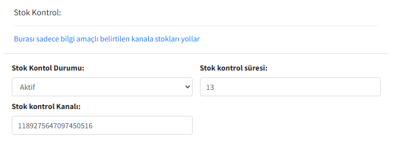
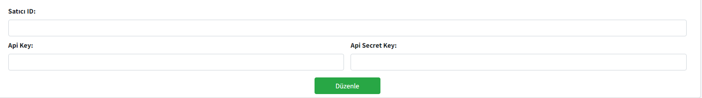

# ClebWeb Bot (C# - D#)

## Stok Güncelleme

🔄 Belirlenen siteden stok sayılarını çeker, ardından verilen barkodlarla bu stok sayılarını eşleştirir ve Trendyol API'sine istek atarak stok sayılarını günceller. Gelen cevabı Discord'da belirlenen kanala mesaj olarak gönderir.

- 📉 Stok Belirlenen sayının altındaysa 0'lamaya ayarlama
- ⚙️ Stok 0'lama Aktif/Pasif yapabilme
- ⏲️ Stok güncelleme süresini ayarlama
- ✅ İstenen Ürünün güncellemesini aktif/pasif yapabilme
- 📬 İstediğiniz Discord Kanalına mesajı gönderme

## Stok Kontrolu

🔄 Belirlenen siteden stok sayılarını çeker ve Ürün - Url - Beden şeklinde belirlenen kanala mesaj olarak gönderilir.

- ⚙️ Stok Kontrol Durumunu aktif/pasif yapabilme
- ⏲️ Stok kontrol süresini ayarlama
- 📬 İstediğiniz Discord Kanalına mesajı gönderme

## Genel Ayarlar

⚙️ Trendyol Satıcı ID - Api Key - Api Secret Key ayarlamaa

## İlişkili Projeler

### Bot Kontrol Paneli

Bu projenin bir parçası olan Bot Kontrol Paneli'ne göz atabilirsiniz:

[Panel Projesi](https://github.com/matiassingers/awesome-readme)
